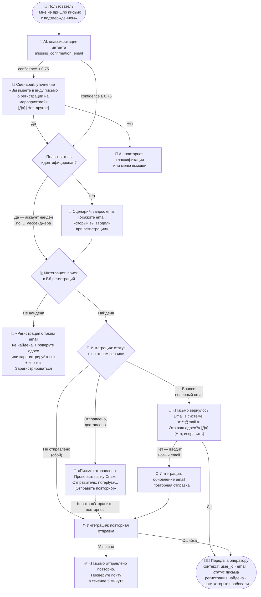

# Тестовое задание — Product Engineer (чат-боты / AI-ассистенты)

**Позиция:** Product Engineer — чат-боты, AI-ассистенты, цифровые помощники
**Контекст:** молодёжные программы и мероприятия, аудитория 16–30 лет, мультиплатформа (VK, Telegram, MAX)

---

## Часть 1. Анализ и подход

### 1.1 С чего начну, придя в такую систему

Первые действия — не в коде, а в данных и людях.

**Шаг 1 — метрики (день 1–2)**
Смотрю на то, что уже есть: объём сообщений по дням/платформам, распределение интентов, процент эскалаций к оператору, среднее время до решения, CSAT (если измеряется). Цель — найти, где система "течёт" сильнее всего.

**Шаг 2 — операторы (день 2–3)**
Сажусь рядом с оператором на 2–3 часа и смотрю, что они реально обрабатывают. Операторы — лучший источник правды о системе: они знают, какие боты врут, где сценарии сломаны и что спрашивают чаще всего. Записываю топ-20 типовых кейсов из их уст.

**Шаг 3 — карта сценариев (день 3–5)**
Прохожу все три платформы руками: кликаю, пишу, ломаю. Строю карту: какие флоу есть, где они пересекаются, где дублируются, где заканчиваются тупиком.

**Шаг 4 — быстрые победы**
К концу первой недели у меня есть список: что можно улучшить за 1–3 дня, что требует архитектурных решений, что нужно просто выключить.

---

### 1.2 Типовые проблемы в такой архитектуре

| Проблема | Почему возникает |
|----------|-----------------|
| **Логика дублируется на каждой платформе** | VK, TG и MAX разрабатывались независимо — одно и то же написано трижды |
| **Нет единой аналитики** | Метрики разрозненные, нельзя понять реальную картину |
| **AI эскалирует слишком агрессивно** | Низкий порог уверенности → оператор получает то, что бот мог решить |
| **Контекст теряется при передаче оператору** | Оператор видит последнее сообщение, а не весь диалог и статус |
| **Нет обратной связи** | Операторы решают задачи, но это не улучшает систему |
| **Сценарии устаревают** | Процесс изменился, бот не обновили — пользователи получают неверную информацию |
| **Коллизии интентов** | «регистрация» может значить разное — бот угадывает неправильно |
| **Нет деградации при ошибке AI** | Если модель не понимает — тупик вместо возврата к сценарному боту |

---

### 1.3 Разделение: сценарий / AI / человек

Ключевой принцип: **сценарий — для предсказуемого, AI — для понимания, человек — для суждения.**

**Сценарный бот** — там, где ответ однозначен и действие структурировано:
- Навигационные меню, кнопки
- FAQ с фиксированными ответами (расписание, адрес, условия участия)
- Транзакционные действия: повторная отправка письма, статус заявки, ссылка на регистрацию
- Welcome-флоу и онбординг

**AI (NLU + LLM-классификация)** — там, где текст свободный и непредсказуемый:
- Классификация интента из произвольного текста («не получила», «куда делось моё письмо», «нет подтверждалки»)
- Извлечение сущностей (email, название мероприятия, дата)
- Обработка опечаток и разговорного языка
- Определение тональности (агрессия, растерянность → быстрее к оператору)
- Disambiguation: когда запрос двусмысленный — уточняющий вопрос

**Оператор** — там, где нужно суждение:
- Конфликты, жалобы, обиды
- Технические сбои, требующие ручного вмешательства
- Нестандартные кейсы вне сценариев
- Повторные обращения: пользователь уже пробовал через бота и не решил
- Работа с персональными данными (изменение email, ФИО)

---

## Часть 2. Проектирование решения

### Кейс: «Мне не пришло письмо с подтверждением участия»

### 2.1 Логика обработки (флоу)



---

### 2.2 Где используется что

| Компонент | Роль в этом кейсе |
|-----------|-----------------|
| **AI / NLU** | Классификация интента из свободного текста. Пользователь может написать «нет письма», «куда делось подтверждение», «не получила ничего» — AI распознаёт это как один интент. Также проверяет confidence и при низком значении передаёт в уточнение |
| **Сценарный бот** | Все шаги после классификации: запрос email, показ статуса, кнопки «отправить повторно» / «исправить email», финальные сообщения. Логика детерминированная — сценарий надёжнее LLM |
| **Интеграции** | (1) БД регистраций — поиск по email/user_id. (2) Почтовый сервис API — проверка статуса письма, повторная отправка. (3) Система пользователей — обновление email при необходимости |

### 2.3 Когда запрос уходит оператору

Оператор получает кейс в трёх случаях — всегда с полным контекстом:

1. **Технический сбой**: повторная отправка письма завершилась ошибкой (проблема на стороне почтового сервиса или системы регистраций)
2. **Неразрешимая ситуация**: email совпадает, bounce нет, письмо якобы доставлено — пользователь всё равно не получил (возможна проблема на стороне почтовика пользователя, корпоративные фильтры)
3. **Повторное обращение**: пользователь уже обращался с этим же вопросом и снова пишет — бот больше не пытается, сразу передаёт

**Что передаётся оператору:**
```
user_id: 12345 | платформа: Telegram
email: a***@mail.ru
регистрация: найдена, мероприятие «Форум X», дата 15.04
статус письма: отправлено 10.04 14:32, bounce: нет
повторная отправка: попытка в 15.04 10:15, статус: ошибка (код 550)
история диалога: [прикреплена]
```

---

## Часть 3. Улучшение системы

### 3.1 Два-три изменения с максимальным эффектом

**Изменение 1 — Единый движок сценариев для всех платформ**

*Проблема:* VK, Telegram и MAX содержат одинаковую логику, написанную трижды. Одно изменение = три правки = тройной шанс на расхождение.

*Решение:* вынести сценарии в платформонезависимый слой (YAML/JSON-конфиги или визуальный редактор). Платформы становятся адаптерами, которые только транслируют UI (кнопки, карточки). Обновление логики — один раз, деплой на все платформы автоматически.

*Эффект:* сокращение времени на поддержку сценариев в 3x, меньше расхождений между платформами.

---

**Изменение 2 — Контекст + петля обратной связи при эскалации**

*Проблема:* оператор получает сообщение без контекста — тратит время на выяснение того, что бот уже знает. Решённые кейсы никуда не попадают — система не учится.

*Решение:*
- При эскалации → автоматически прикреплять карточку: история диалога, данные пользователя, что уже пробовал бот, статус интеграций.
- После закрытия оператором → обязательный тег «тип решения» (1 клик). Теги агрегируются еженедельно → продукт видит, какие кейсы можно автоматизировать.

*Эффект:* оператор закрывает кейс быстрее (контекст готов), команда видит точки роста автоматизации.

---

**Изменение 3 — Умная приоритизация перед эскалацией**

*Проблема:* все эскалации в одну очередь. Расстроенный пользователь ждёт столько же, сколько тот, кто просто уточняет.

*Решение:* добавить scoring перед передачей оператору:
- Негативная тональность + технический сбой = высокий приоритет
- Повторное обращение = высокий приоритет
- Информационный вопрос, бот "застрял" = обычный приоритет

Оператор видит очередь, отсортированную по приоритету, а не по FIFO.

*Эффект:* пользователи с реальными проблемами получают помощь быстрее, лояльность растёт.

---

### 3.2 Что точно не стоит делать

- **Переписывать с нуля.** Сценарные боты работают — это ценность. Риск миграции > выгода от "чистой" архитектуры.
- **Заменять сценарный бот LLM-ом целиком.** LLM стохастичен — в транзакционных флоу (отправить письмо, найти регистрацию) нужна предсказуемость. LLM здесь — слой понимания, не слой исполнения.
- **Игнорировать операторов при внедрении AI.** Они воспримут автоматизацию как угрозу, если не вовлечь их. Правильный фрейм: «AI берёт рутину, вам остаётся интересное».
- **Добавлять AI туда, где intent уже однозначен.** Если пользователь нажал кнопку «Расписание» — не нужен NLU, нужен ответ. LLM здесь — лишние деньги и latency.

---

## Часть 4. Как использовать LLM в этой системе

Ключевой принцип: **LLM усиливает людей и сценарии, но не заменяет их.**

### 4.1 Генерация обучающих данных для NLU

*Проблема:* качество NLU зависит от разнообразия примеров. Писать их вручную — долго.

*Решение:* LLM генерирует 50–100 перефразировок для каждого интента в стиле молодёжной аудитории («письмо не пришло», «нет подтверждалки», «куда делось сообщение», «не получила нихуя», «где мой мейл»). Команда проверяет и добавляет батчами. NLU становится точнее без ручной разметки.

### 4.2 Copilot для операторов

*Проблема:* операторы отвечают по-разному, тратят время на набор текста, джуны ошибаются в тоне.

*Решение:* при открытии кейса LLM генерирует черновик ответа на основе контекста диалога + базы одобренных FAQ. Оператор видит: «Предлагаемый ответ: [текст] — Отправить / Редактировать». Скорость обработки растёт, качество выравнивается.

Важно: оператор всегда контролирует отправку — LLM не пишет пользователю напрямую.

### 4.3 Еженедельный анализ неразрешённых кейсов

*Проблема:* система не знает, о чём её не спрашивали — нерешённые кейсы исчезают.

*Решение:* LLM еженедельно анализирует эскалированные и нерешённые диалоги → выделяет кластеры новых тем → формирует отчёт: «За неделю 47 пользователей спросили про X, сценария нет». Продукт получает данные для приоритизации.

### 4.4 Tone-aware responses

*Проблема:* бот отвечает одинаково независимо от эмоционального состояния пользователя.

*Решение:* LLM определяет тональность (нейтральная / растерянная / агрессивная) и адаптирует шаблон ответа:
- Растерянный → более мягко, с объяснением шагов
- Агрессивный → эмпатия + быстрый выход к оператору
- Нейтральный → эффективно и коротко

Реализация: LLM не генерирует текст свободно, а выбирает вариант из 2–3 одобренных шаблонов для каждого сценария — предсказуемо и безопасно.

---

## Итоговая модель

```
Пользователь
     ↓
[AI / NLU] — понимает, классифицирует, извлекает тональность
     ↓
[Сценарный бот] — детерминированно исполняет, интегрируется с системами
     ↓
[Оператор] — суждение, конфликты, нестандартные кейсы
     ↑
[LLM как инструмент] — помогает NLU, помогает оператору, анализирует систему
```

Эволюция без революции: текущая система работает — её нужно связать, обогатить и научить учиться на собственном опыте.
