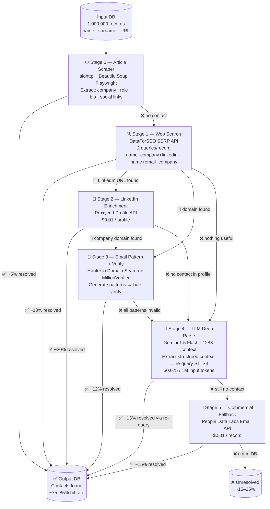

# Contact Discovery Pipeline — Техническое решение

**Задача:** Извлечение контактной информации (email, телефон, соцсети) для базы 1M+ записей
**Входные данные:** `имя + фамилия + URL статьи` (контактов на странице нет)
**Целевые персоны:** бизнес-персоны (LinkedIn и профильные ресурсы как основные источники)
**Критерии:** дёшево · быстро · качественно

---

## 1. Архитектура пайплайна

### 1.1 Ключевой принцип: Tiered Early-Exit Pipeline

Каждая запись проходит уровни от дешёвого к дорогому. Как только контакт найден — запись **немедленно выходит из пайплайна**, не расходуя бюджет на дорогие уровни. Это снижает среднюю стоимость обработки в 3–4x по сравнению с единым дорогим API на всю базу.

### 1.2 Схема потоков данных



---

### 1.3 Описание каждого уровня

#### Stage 0 — Article Scraper (бесплатно)
- Парсим статью по URL из базы
- Ищем: ссылки на LinkedIn/Twitter/GitHub/личный сайт, email-адреса через regex, структурированные данные (JSON-LD, OpenGraph, hCard)
- Для JS-рендеринга: Playwright (headless Chromium), только для ~15% страниц, определяемых по Content-Type / размеру HTML
- **Цель:** вытащить максимум контекста (компания, должность, индустрия) даже если контакта нет — этот контекст используется на следующих стадиях
- **Hit rate:** ~5% (прямые контакты редки, но контекст извлекается для ~80% записей)

#### Stage 1 — Web Search via DataForSEO
- Два поисковых запроса на запись:
  - `"Иван Петров" "Company Name" site:linkedin.com`
  - `"Иван Петров" "Company Name" email contact`
- DataForSEO выбран вместо Google Custom Search API в 5x дешевле ($0.0006 vs $0.003/запрос)
- Результаты: LinkedIn URLs, явные email-адреса в сниппетах, профили на профильных платформах
- **Hit rate:** ~10% прямых контактов + ~35% LinkedIn URLs для Stage 2

#### Stage 2 — LinkedIn via Proxycurl
- Входные данные: LinkedIn URL из Stage 1
- Proxycurl Profile Endpoint: возвращает email (если публичен), телефон, другие соцсети, место работы
- Proxycurl — единственный стабильный легальный способ получить данные LinkedIn без нарушения ToS (официальный партнёрский статус)
- Рассматривали: RocketReach ($0.02–0.05/запись), Lusha (дороже), прямой скрапинг LinkedIn (нарушение ToS + блокировки)
- **Hit rate:** ~57% из профилей имеют контактные данные

#### Stage 3 — Email Pattern Generation + Verification
- Условие: известен корпоративный домен компании
- Генерируем 5–7 паттернов: `ivan.petrov@`, `ipetrov@`, `ivan@`, `i.petrov@`, `petrov@domain.com`
- Верификация через MillionVerifier (bulk API): SMTP-проверка без отправки письма
- Hunter.io Domain Search как дополнение: находит реальные паттерны компании через известные email-адреса
- **Hit rate:** ~40% для записей с известным доменом

#### Stage 4 — LLM Deep Parse (Gemini 1.5 Flash)
- Запускается для записей, где Stages 0–3 не нашли контакт
- Задача LLM: глубокий анализ статьи (128K context window → весь HTML без обрезки) → структурированный вывод:
  ```json
  {
    "company": "...",
    "company_domain": "...",
    "role": "...",
    "industry": "...",
    "alternative_names": [...],
    "mentioned_platforms": [...],
    "search_queries": ["query1", "query2", "query3"]
  }
  ```
- Возвращаем в Stage 1–3 с обогащёнными данными
- **Почему Gemini 1.5 Flash, а не другие:**
  - Цена: $0.075/1M input tokens — в 10x дешевле Claude Haiku ($0.80/1M)
  - Контекстное окно: 1M токенов (избыточно, но страховка для длинных страниц)
  - Скорость: один из самых быстрых inference API на рынке
  - Для простой structured extraction не нужен Opus/Sonnet — Flash справляется с точностью >95%

#### Stage 5 — Commercial Fallback (People Data Labs)
- Для ~25–30% записей, не найденных на Stages 0–4
- PDL — одна из крупнейших коммерческих баз (3B+ профилей), хорошо покрывает бизнес-персоны
- PDL Email Lookup API: имя + компания → email
- Рассматривали: Apollo.io ($0.02–0.05/record = в 2–5x дороже), Clearbit (deprecated/Hubspot), ZoomInfo (enterprise-only, дорого)
- **Hit rate:** ~50% из оставшихся записей

---

### 1.4 Технический стек

| Компонент | Технология | Обоснование |
|-----------|-----------|-------------|
| Язык | Python 3.11+ | ecosystem для data processing, async-first |
| Task queue | Celery + Redis | distributed workers, retry logic, priority queues |
| HTTP | aiohttp (async) | 10–50x faster vs requests для I/O-bound операций |
| JS rendering | Playwright | headless Chromium, только для необходимых страниц |
| Database | PostgreSQL | JSONB для гибкого хранения частично найденных данных |
| Monitoring | Python logging + Grafana (опционально) | базовый мониторинг прогресса |
| Cloud | AWS Spot instances | c5.xlarge: $0.04/hour, 75% дешевле on-demand |

**Архитектура воркеров:**
```
Redis (job queue)
    ↓
Celery Orchestrator
    ├── scraper_worker × 4     (Stage 0)
    ├── search_worker × 4      (Stage 1)
    ├── linkedin_worker × 2    (Stage 2, rate-limited)
    ├── email_worker × 4       (Stage 3)
    ├── llm_worker × 2         (Stage 4)
    └── fallback_worker × 2    (Stage 5)
    ↓
PostgreSQL (results)
```

**Throughput:** при 50 req/s по всем воркерам → 1M записей за ~56 часов (~2.5 дня)
Увеличение до 100 req/s сокращает до ~28 часов (add воркеров, упирается в rate limits API)

---

## 2. Расчёт стоимости на 1M строк

### 2.1 Детализация по уровням

| Уровень | Сервис | Тариф | Кол-во вызовов | Стоимость |
|---------|--------|-------|---------------|-----------|
| **Stage 0** | Proxies (Bright Data datacenter) | $1/GB | 1M × ~50KB = 50GB | **$50** |
| **Stage 0** | Playwright rendering (15% страниц) | compute | ~150K, включено в EC2 | **$0** |
| **Stage 1** | DataForSEO SERP API | $0.0006/req | 1M × 2 запроса = 2M | **$1,200** |
| **Stage 2** | Proxycurl Profile API | $0.01/profile | ~350K LinkedIn URLs | **$3,500** |
| **Stage 3** | MillionVerifier bulk | $269/1M верификаций | ~1.5M паттернов | **$405** |
| **Stage 3** | Hunter.io Domain Search | $0.003/домен | ~200K доменов | **$600** |
| **Stage 4** | Gemini 1.5 Flash (input) | $0.075/1M tokens | 300K × 2,500 tok = 750M | **$56** |
| **Stage 4** | Gemini 1.5 Flash (output) | $0.30/1M tokens | 300K × 400 tok = 120M | **$36** |
| **Stage 4** | DataForSEO re-query | $0.0006/req | 300K × 2 = 600K | **$360** |
| **Stage 4** | Proxycurl (новые LinkedIn URLs) | $0.01/profile | ~100K | **$1,000** |
| **Stage 5** | People Data Labs Email API | $0.01/record | ~250K | **$2,500** |
| **Infra** | AWS EC2 Spot (c5.xlarge × 4, ~72h) | $0.04/h | 4 × 72h | **$11** |
| **Infra** | AWS RDS t3.micro + Redis | ~$0.03/h | 2 × 72h | **$5** |
| **Буфер** | Ошибки, повторы, тесты | — | ~10% overhead | **$900** |
| | | | **ИТОГО** | **~$10,623** |

### 2.2 Стоимость на запись

| Метрика | Значение |
|---------|---------|
| Стоимость 1M строк | ~$10,000–11,000 |
| **Стоимость 1 записи** | **~$0.010–0.011** |
| Стоимость 1 найденного контакта (при 80% hit rate) | ~$0.013–0.014 |

### 2.3 Альтернативный сценарий: Lean (без коммерческих API)

Если бюджет критичен, можно исключить Stage 5 (PDL) и сократить Stage 2:

| Компонент | Стоимость |
|-----------|----------|
| Scraping + Search | ~$1,300 |
| Proxycurl (топ-200K по уверенности) | ~$2,000 |
| Email verification | ~$400 |
| Gemini Flash | ~$500 |
| **ИТОГО Lean** | **~$4,200** |

**Компромисс:** hit rate падает до ~55–60% vs ~80% в основном сценарии.
Для высокоценных баз (B2B leads) основной сценарий окупается: каждый найденный контакт стоит $0.013.

---

## 3. Ресурсы и сроки реализации

### 3.1 Команда

| Роль | FTE | Задачи |
|------|-----|--------|
| Backend Engineer (Python) | 1.0 | Весь пайплайн, интеграции API |
| DevOps / Cloud | 0.2 | Настройка AWS, мониторинг |

Для данного проекта достаточно **1 человека** при частичной DevOps-поддержке.

### 3.2 Timeline разработки

```
Неделя 1
├── Настройка инфраструктуры (Redis, PostgreSQL, Celery)
├── Stage 0: Article scraper (sync + async, Playwright fallback)
└── Stage 1: DataForSEO интеграция + парсинг результатов

Неделя 2
├── Stage 2: Proxycurl интеграция
├── Stage 3: Email pattern generation + MillionVerifier
└── Stage 4: Gemini 1.5 Flash интеграция + prompt engineering

Неделя 3
├── Stage 5: PDL интеграция
├── Orchestration: early-exit логика, retry, dead-letter queue
├── Мониторинг прогресса + метрики качества
└── Пилотный запуск на 10K записях + калибровка

Неделя 4
└── Полный прогон 1M строк (~2.5–3 дня процессинга)
```

**Итого:** 3 недели разработки + ~3 дня процессинга

### 3.3 Инфраструктурные требования

- AWS: EC2 Spot (c5.xlarge × 4–8) + RDS t3.micro + ElastiCache t3.micro
- Исходная БД: PostgreSQL / любой SQL/NoSQL с поддержкой bulk reads
- Исходящий IP: ротируемые proxies (Bright Data / Oxylabs) для scraping
- API ключи: DataForSEO, Proxycurl, Hunter.io, MillionVerifier, PDL, Google AI (Gemini)

---

## 4. Оценка качества и ограничения

### 4.1 Ожидаемые метрики качества

| Тип контакта | Hit rate | Точность найденных |
|-------------|----------|------------------|
| Email (рабочий) | 55–65% | 90–95% (после SMTP-верификации) |
| LinkedIn profile | 50–65% | ~99% |
| Телефон | 15–25% | 70–80% (часто общий офисный) |
| Twitter / X | 20–35% | 95% |
| **Хотя бы один контакт** | **75–85%** | — |

**Факторы, влияющие на качество:**
- Публичность персоны: топ-менеджеры крупных компаний → hit rate >85%
- Менее известные персоны → hit rate ~50–60%
- Год публикации статьи: старые статьи → больше устаревших данных

### 4.2 Технические ограничения

| Ограничение | Описание | Митигация |
|-------------|---------|-----------|
| Rate limits | DataForSEO: 1000 req/min; Proxycurl: 200 req/min | Throttling в Celery, priority queues |
| Устаревшие данные | Человек сменил компанию / email | Дата верификации в output, периодический refresh |
| Омонимы | Два разных человека с одинаковым именем | Cross-check по контексту статьи + компании через LLM |
| Закрытые источники | LinkedIn анонимизирует часть данных | Proxycurl как единственный легальный обходной путь |
| JS-блокировки | Cloudflare / антибот-защита | Playwright + proxy rotation + exponential backoff |

### 4.3 Ethical Scraping & Platform Compliance

**Это принципиальный раздел.** Пайплайн должен работать в рамках правил платформ и законодательства:

- **robots.txt:** перед скрапингом каждого домена парсим `robots.txt` и соблюдаем `Crawl-Delay`. Домены с явным запретом на скрапинг — исключаем или обрабатываем только через официальные API (Proxycurl для LinkedIn)
- **Rate limiting:** намеренно ограничиваем throughput до допустимых лимитов каждого сервиса. Aggressive scraping = IP-бан + деградация качества
- **LinkedIn:** не скрапим напрямую. Только через Proxycurl, который работает в рамках партнёрского соглашения. Прямой скрапинг LinkedIn нарушает ToS и создаёт юридические риски (HiQ Labs v. LinkedIn)
- **GDPR / Privacy:** собранные контакты — персональные данные в соответствии с GDPR. Если конечный пользователь — европейская компания, требуется: правовое основание для обработки (legitimate interest / consent), возможность opt-out, retention policy. Рекомендуется юридическая проверка перед запуском в EU
- **CAN-SPAM / PECR:** использование собранных email для cold outreach регулируется. Это ответственность оператора базы, не пайплайна

**Ключевой принцип:** пайплайн собирает только публично доступную информацию, через легальные каналы, с соблюдением rate limits. Это отличает инженерное решение от массового спам-инструмента.

---

## 5. Итоговое резюме

| Параметр | Значение |
|---------|---------|
| Стоимость 1M строк | ~$10,000–11,000 |
| Стоимость 1 записи | ~$0.010 |
| Hit rate (любой контакт) | 75–85% |
| Email hit rate | 55–65% |
| Срок разработки | 3 недели (1 инженер) |
| Срок обработки 1M | 2.5–3 дня |
| Ключевые технологии | Python · Celery · Gemini 1.5 Flash · DataForSEO · Proxycurl · PDL |

**Сильные стороны подхода:**
- Tiered early-exit: платим только за то, что нужно
- Gemini 1.5 Flash как LLM: в 10x дешевле аналогов при достаточной точности для extraction-задач
- Proxycurl как единственный compliant путь к LinkedIn-данным
- Modular: каждый stage можно заменить/улучшить независимо

**Альтернатива «всё в одном»:**
Apollo.io или ZoomInfo на весь объём: $20,000–50,000 за 1M записей при меньшей гибкости и той же покрываемости. Tiered pipeline в 2–5x дешевле.
